## Water-polo scoreboard

This application is used for keeping track of the remaining time and the scoring. It also handles the shotclock and the fouls.

The application can be started on other devices in view mode. The scoreboard can also be viewed in a web page.

The application runs on Windows and Android. A web-based version is also available.

A minimal game setup would be the main computer running the application and a second computer running the application in view mode. With two laptops and a large screen attached to the second laptop, spectators can thus view the scoreboard.

The Windows installer can be found in the subfolder **Windows**
The Android version is in the **Android** folder. It is an apk file.

For testing the web version, go to [Water-polo scoreboard](https://gcote2019.github.io/WaterPoloScoreboard/)

#### Limitations
The web-based version is limited. No viewer can connect to it. It cannot update the view-only web page.

The Android version is also limited. It cannot update the view-only web page but other devices can connect to it to view the scoreboard. It is better to use it as a viewer. 

It is strongly recommend to use the Windows version as the main application.

### The welcome screen
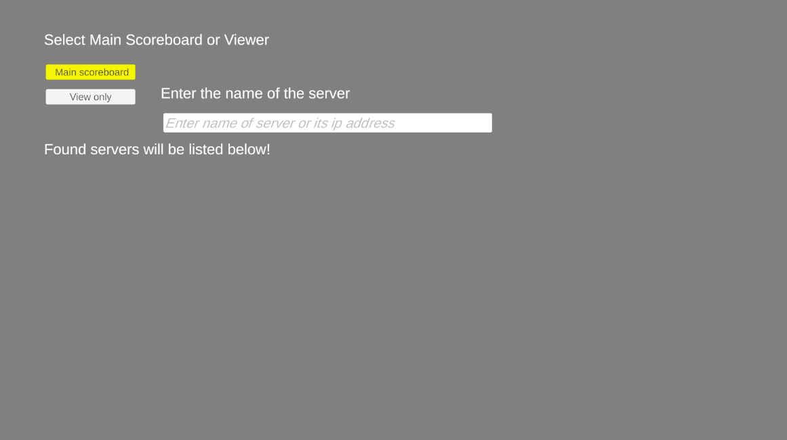

You have the choice between operating the scoreboard (Main Scoreboard) or launching a viewer. If you launch a viewer, you either have to select a listed server, or provide the ip address or the name of the machine running the main scoreboard.

#### Main scoreboard

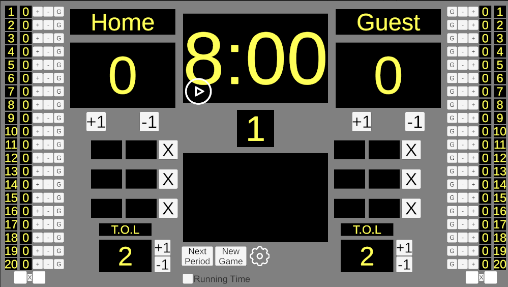

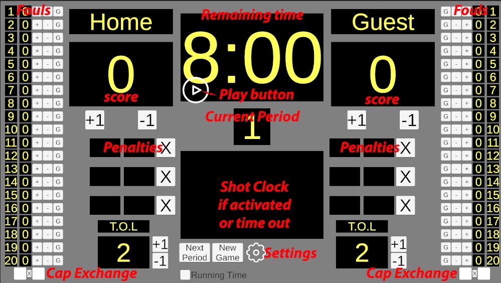

#### Settings
After pressing the _Settings_ button, this dialog is shown

##### Game Settings

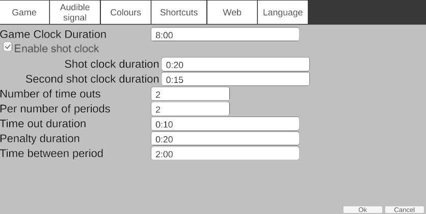
All configurable durations are in minutes:seconds.
You can set the duration of a period. The maximum value is 999:59.
You can enable the shot clock and set its duration
You can also set the number of time outs and its duration.
For instance, here, each team has two time outs for every two periods.
Finally, you can set the duration of a penalty.

#### Sound Settings

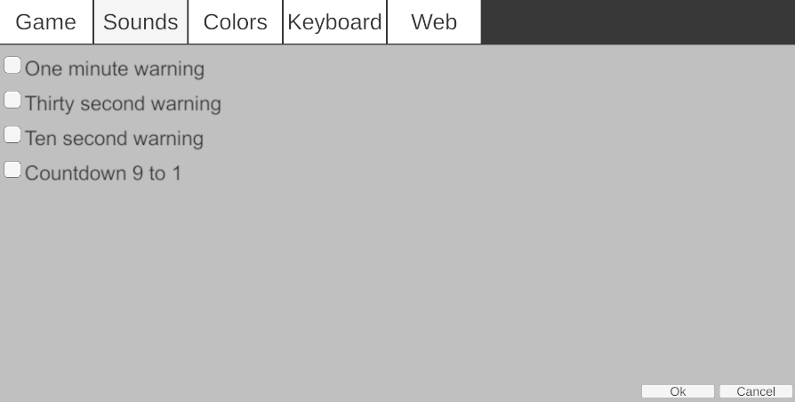
A sound can be played to indicate the remaining time.

#### Color Settings

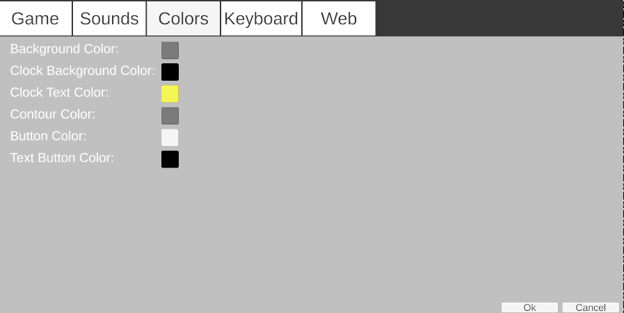
Default colors can be changed.

#### Keyboard shortcuts

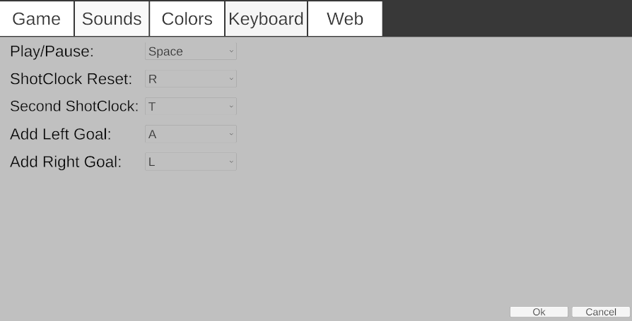
Currently, these values cannot be modified.
On a viewer, you can press "PageUp" to toggle between the full scoreboard and the shot clock.

Following images taken from [tatinui](https://www.titanui.com/49580-xbox-one-controller-buttons-psd/)

If you connect an Xbox controller to your computer, you can use these buttons 
 to start/stop the game clock.  
 to reset the shot clock.  
 to reset the shot clock to the second value.  

#### Web Server

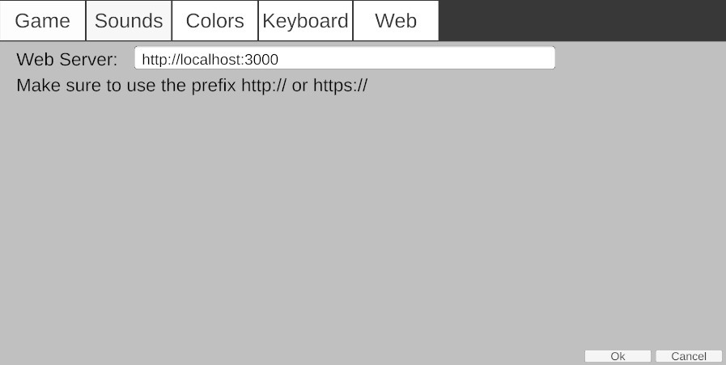

It is possible to update a web page to allow spectators to view the scoreboard if you have a server. See [Web Server](#how-to-set-up-the-web-server) on how to configure it. 
Make sure that the prefix http:// or https:// is used.

Game events like goals will be shown on the web page. You can optionnally provide your preferred terms.

### Team names
If you double-click on a name, you can start editing it. Press Enter to apply.
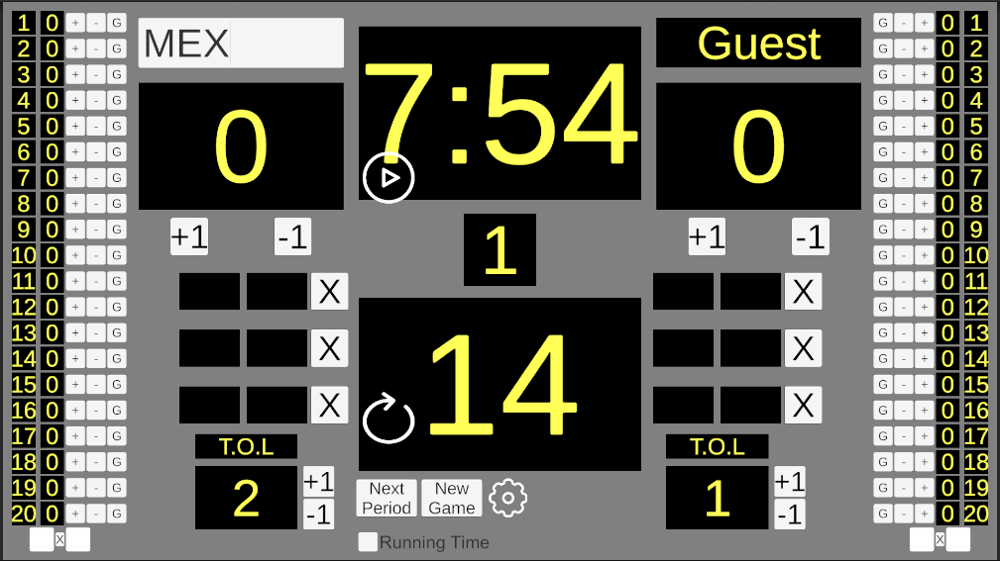
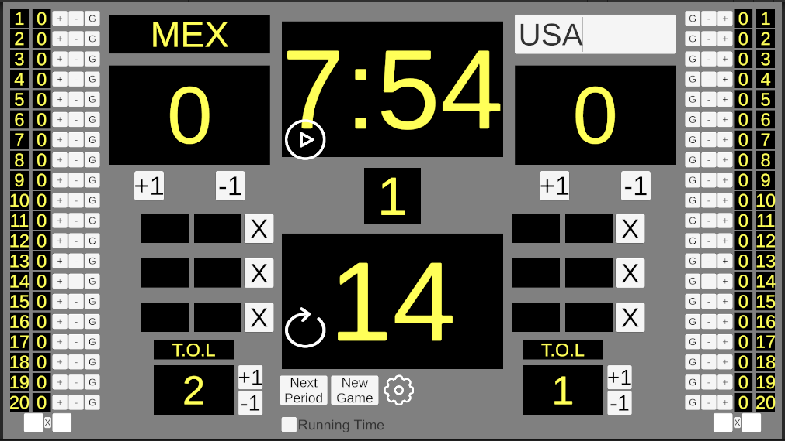

### Score

Click on the G button next to a player's number when they score a goal.   
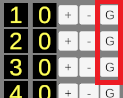  

You can alternately click on the +1 to add a goal but it won't list the player's number.  
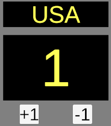

### Game Clock
Once you press "Play", the button changes   
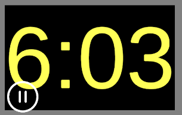  

When the clock has less than a minute, it shows only the seconds.

When the clock has less than ten seconds, it shows the decimal value.

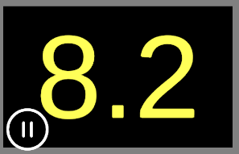

When the remaining time reaches 0, a loud buzzer sound is played.

#### Editing the Game Clock
By double-clicking on the game clock, it possible to edit its value.  
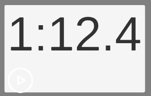  
The format has to be minutes:seconds, minutes:seconds.tenth, seconds or seconds.tenth. The maximum value is 999:59.9.

### Shot Clock
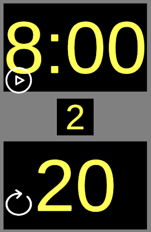

The shot clock starts and stops with the game clock.

When the shot clock has less than ten seconds, it shows the decimal value.

When the remaining time on the shot clock reaches 0, a loud buzzer sound is played.

When the remaining time on the game clock is less than the time of the shot clock, the shot clock shows the same time as the game clock. It doesn't get blanked.

#### Editing the Shot Clock
By double-clicking on the shot clock, it possible to edit its value.

### Time Outs
Time Outs Left are shown in the T.O.L sections.
Click on the -1 button to start a timeout. The time out clock is then shown instead of the shot clock. 
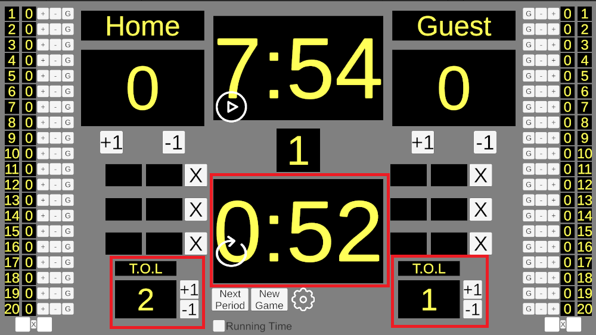

Press the Escape key to cancel the time out.

### Fouls

Fouls are shown on each side of the scoreboard.  
If you press on the plus button, it adds a foul to that player and a penalty is also added.  
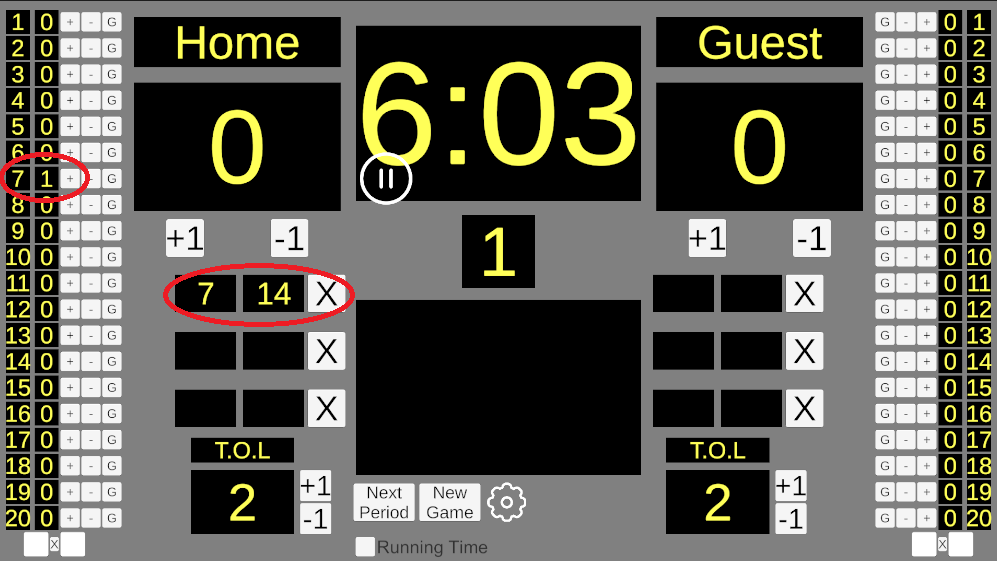

You can press on the corresponding X button to remove it.

### Cap Exchange
It is possible to exchange players' cap number.  
For instance, if you want to exchange cap #6 and cap #7  
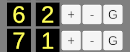  
Enter 6 and 7 in the Cap Exchange area   
  
Press on the X button to do the exchange    
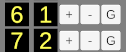  

### Viewer
(Not available in the Web version)
If you click on a detected server or on the viewer button (after entering the proper information), you can view the scoreboard
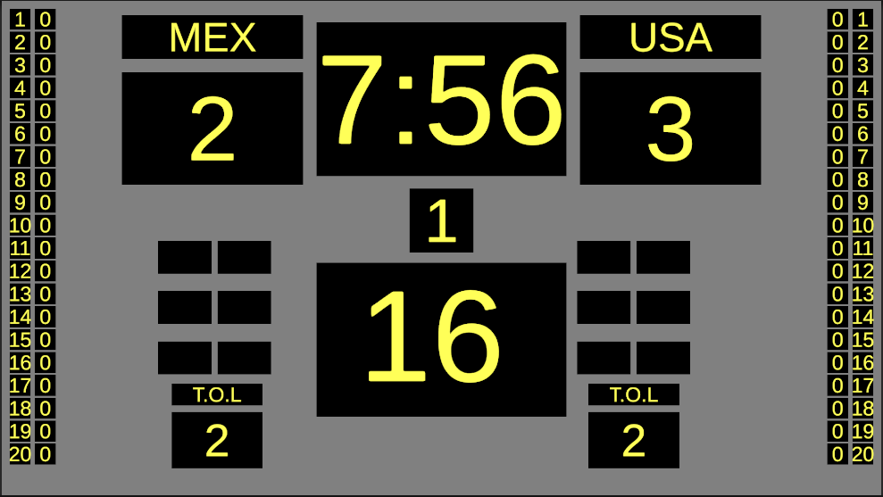

You can also press the PageUp button in order to view a different layout with only the game clock and the shot clock in order to have a shot clock display.

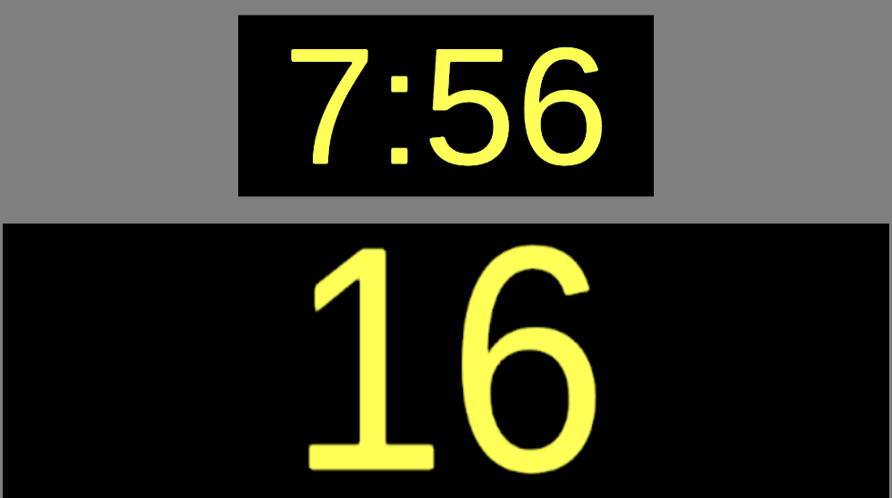

The viewers communicate with the server via the network. You need a connection to a local area network at least.

###  How to set up the web server
It is possible to set up a web page for anyone to see in the world.

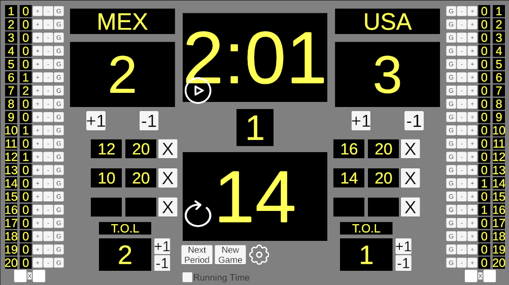
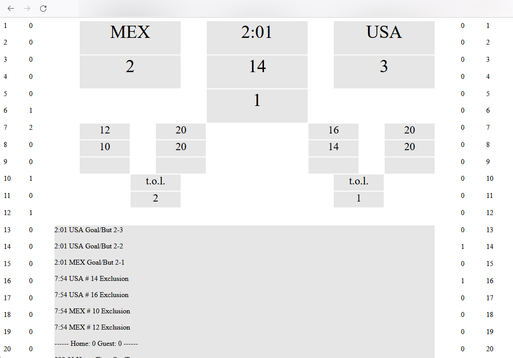
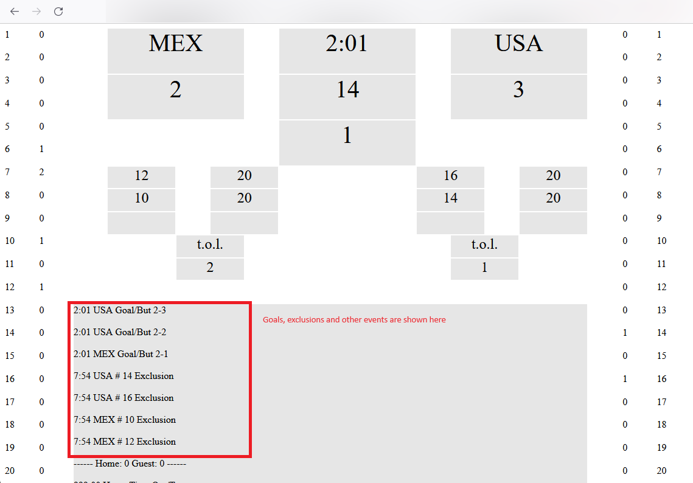

It is a bit technical but not difficult.
Here's the recipe for Windows but it is quite similar for other OSes. You don't need programming skills.

1. Install [NodeJS](https://nodejs.org/en/download/current).
2. Verify that it works by running the command "node -v" in a command prompt.
3. Download the source code and _*extract*_ it in a folder.
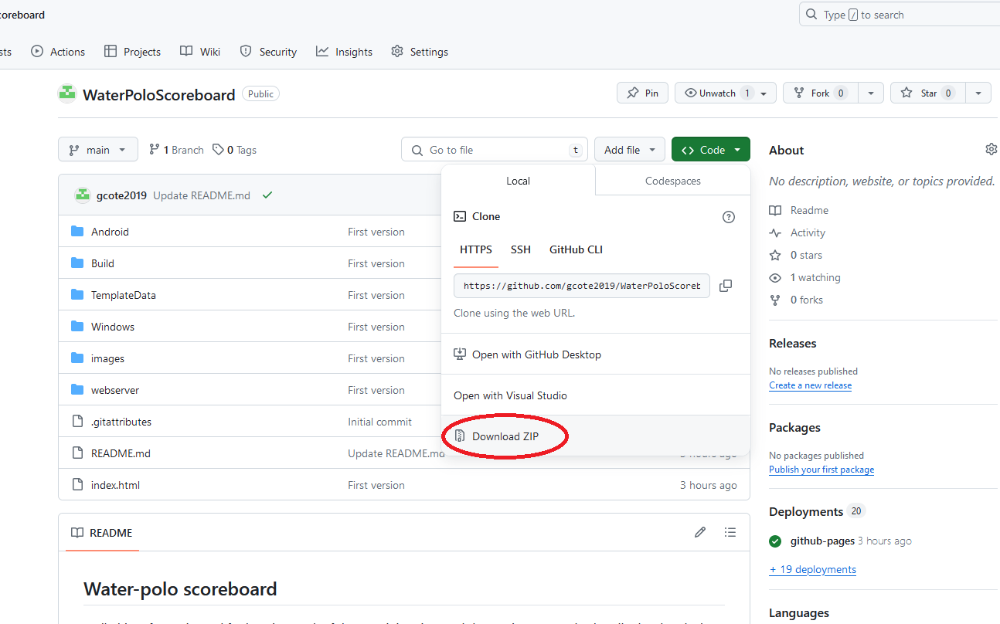
4. Once extracted, go to the webServer subfolder.
5. In a command prompt in the webServer subfolder
   * run these 2 commands *once*
     *  npm install express
     *  npm install socket.io
 
6.  When ready to launch the web server, run this command from the same webServer folder
    *  node index.js

You should be able to view the page by going to [localhost:3000](localhost:3000) in your web browser.

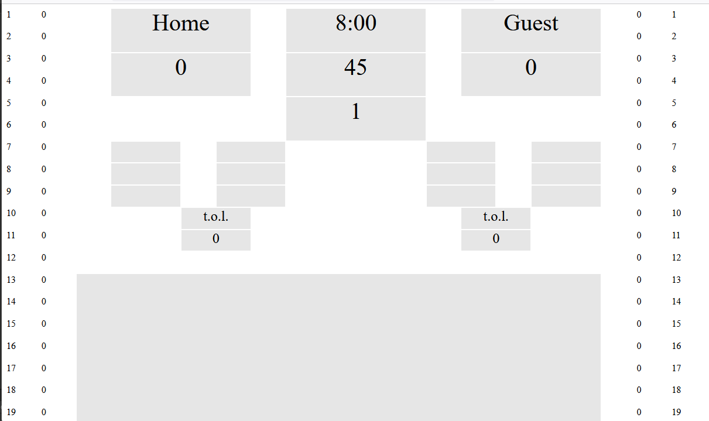
In the main scoreboard, go to Settings/Web, enter "http://localhost:3000", press Ok.

If you press "Play" in the scoreboard, it should start updating in the browser too.

##### Make it accessible from anywhere
If the web server is running on a local machine, the web page isn't accessible to the outside world. It is possible to open it for everyone if you have access to the router. Configure port forwarding for port 3000. Protocol is TCP.

If you are tech savvy, you could also set up a machine on the cloud, for instance, Oracle Cloud _*free*_ tier and install the web server on it. You get an ip address to connect to that machine.

You can also use a free dynamic DNS service provider [dynu.com](https://www.dynu.com/en-US/) to get an easy to remember domain name that points to that machine.

You can try scoreboard.ddnsgeek.com:3000 which is a machine on Oracle Cloud running an instance of the server. Beware that it may be in use by other users.

#### Remote viewer
If the main scoreboard is running on a local machine, once again, a remote viewer can't connect to it unless you enable port forwarding for port 8368. Once the port is opened to the outside world, a viewer can connect to it by entering the WAN ip address.

