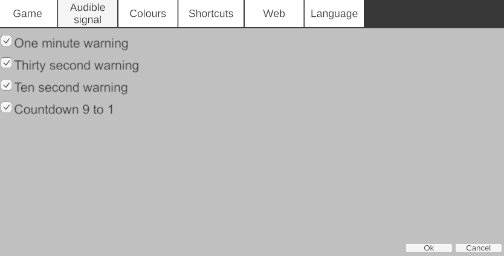
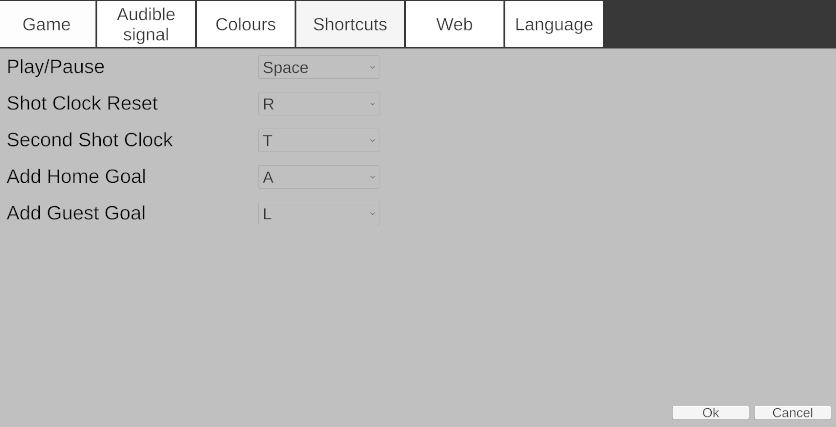
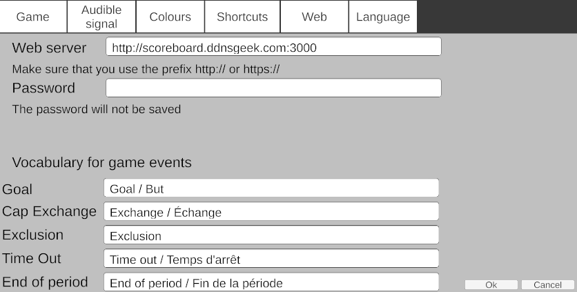

# Water-polo scoreboard

This application is designed to manage a game's scoreboard, including timekeeping, scoring, the shot clock, and team fouls.

It supports multiple platforms, including **Windows**, **Android**, and a **web-based** version. It also offers viewer functionality on additional devices and web browsers.

The score can be displayed during live streams using OBS.  
  
Image from [radio-canada](https://images.radio-canada.ca/q_auto,w_1250/v1/ici-info/sports/16x9/water-polo-mondiaux-canada-france.png)

## Setup Overview
The application runs on both Windows and Android. A web-based version is also available, though more limited.

A minimal setup includes:

+ One computer running the Main Scoreboard.
+ A second computer in Viewer mode connected to a large screen for spectators.

## Installation
+ **Windows** installer: in the Windows subfolder.
+ **Android** APK: in the Android folder.
  
For testing the web version, go to [Water-polo scoreboard](https://gcote2019.github.io/WaterPoloScoreboard/)

# ❗ Web Version Limitations
+ Cannot act as a viewer.
+ Cannot update the view-only web page.

### The welcome screen

You can choose to:
+ Operate the Main Scoreboard
+ Launch a Viewer

To connect as a viewer, select a listed server or manually enter the IP or device name of the scoreboard host.

#### Main scoreboard

## Settings
Accessed via the **Settings** button.

#### Game Settings

+ Period duration (max: 999:59)
+ Enable/disable shot clock
+ Shot clock duration
+ Timeouts per team and per period
+ Timeout duration
+ Penalty duration

#### Audible Signal

  
A sound can be configured to alert when time is running out.

#### Colour Settings

  
You can change the default interface colors.

#### Keyboard shortcuts

+ Shortcuts are currently fixed.
+ In viewer mode: press PageUp to toggle scoreboard display.

(From [tatinui](https://www.titanui.com/49580-xbox-one-controller-buttons-psd/))

If you connect an Xbox controller to your computer, you can use these buttons   
  
   : Start/Stop game clock  
   
   : Reset shot clock  
  
   : Reset shot clock (secondary value)

#### Web Server

+ Allows real-time updates of a web page scoreboard.
+ Configure under **Settings > Web**
+ Custom labels for events (e.g., goals)
  
#### Language

  
Supports **English** and **French**.

### Team names
Double-click a team name to edit. Press *Enter* to confirm.

### Score

Click on the G button next to a player's number when they score a goal.   
  

You can alternately click on the +1 to add a goal but it won't list the player's number.  

### Game Clock
Once you press "Play", the button changes   
  

When the clock has less than a minute, it shows only the seconds.

When the clock has less than ten seconds, it shows the decimal value.

When the remaining time reaches 0, a loud buzzer sound is played.

#### Editing the Game Clock
By double-clicking on the game clock, it possible to edit its value.  
  
The format has to be minutes:seconds, minutes:seconds.tenth, seconds or seconds.tenth. The maximum value is 999:59.9.

### Shot Clock

The shot clock starts and stops with the game clock.

When the shot clock has less than ten seconds, it shows the decimal value.

When the remaining time on the shot clock reaches 0, a loud buzzer sound is played.

When the remaining time on the game clock is less than the time of the shot clock, the shot clock shows the same time as the game clock. It doesn't get blanked.

#### Editing the Shot Clock
By double-clicking on the shot clock, it possible to edit its value.

### Time Outs
Time Outs Left are shown in the T.O.L sections.
Click on the -1 button to start a timeout. The time out clock is then shown instead of the shot clock. 

Press the Escape key to cancel the time out.

### Fouls

Fouls are shown on each side of the scoreboard.  
If you press on the plus button, it adds a foul to that player and a penalty is also added.  

You can press on the corresponding X button to remove it.

### Cap Exchange
It is possible to exchange players' cap number.  
For instance, if you want to exchange cap #6 and cap #7  
  
Enter 6 and 7 in the Cap Exchange area   
  
Press on the X button to do the exchange    
  

### Viewer
(Not available in the Web version)
If you click on a detected server or on the viewer button (after entering the proper information), you can view the scoreboard

You can also press the PageUp button in order to view a different layout with only the game clock and the shot clock in order to have a shot clock display.

The viewers communicate with the server via the network. You need a connection to a local area network at least.

###  How to set up the web server
It is possible to set up a web page for anyone to see in the world.

It is a bit technical but not difficult.
Here's the recipe for Windows but it is quite similar for other OSes. You don't need programming skills.

1. Install [NodeJS](https://nodejs.org/en/download/current).
2. Verify that it works by running the command "node -v" in a command prompt.
3. Download the source code and _*extract*_ it in a folder.

4. Once extracted, go to the webServer subfolder.
5. In a command prompt in the webServer subfolder
   * run these 3 commands *once*
     *  npm install express
     *  npm install socket.io
     *  npm install socket.io-client
 
6.  When ready to launch the web server, run this command from the same webServer folder
    *  node index.js  
You can run multiple instances of the web server on the same machine. But each instance needs a different port.
   * Two parameters can be configured. 
     * The port is 3000 par default but it can be modified
     * To prevent others from modifying the scoreboard, you can also supply a password.
*  run the command
*  node index.js configuration.json  
  
where the file "configuration.json" contains
{
  "port":3000,
  "password": "",
  "html_file": "index.html"
}

Check out the file *index_3000.json*.

Using the configuration file, you can specify the port, the password and even the html file.

You should be able to view the page by going to [localhost:3000](localhost:3000) in your web browser.

In the main scoreboard, go to Settings/Web, enter "http://localhost:3000", press Ok.

If you press "Play" in the scoreboard, it should start updating in the browser too.

##### Make it accessible from anywhere
If the web server is running on a local machine, the web page isn't accessible to the outside world. It is possible to open it for everyone if you have access to the router. Configure port forwarding for port 3000. Protocol is TCP.

If you are tech savvy, you could also set up a machine on the cloud, for instance, Oracle Cloud _*free*_ tier and install the web server on it. You get an ip address to connect to that machine.

You can also use a free dynamic DNS service provider [dynu.com](https://www.dynu.com/en-US/) to get an easy to remember domain name that points to that machine.

You can try scoreboard.ddnsgeek.com:3000 which is a machine on Oracle Cloud running an instance of the server. Beware that it may be in use by other users.

#### Streaming with OBS
Once the web server is running, you can launch a second web server with this command
* node obs.js another_configuration_file.json 
By default, the OBS server listens to http://localhost:3000 and uses the port 3001
You can view the new page by visiting the page http://ip_address:3001, You can test on the same computer by opening the page localhost:3001 in your browser.
In OBS, add a source to the scene
  
Select Browser and give it a name
  
  
You can change the colour of the text. By default, it is black.
Once done, you can position the text
  
and you get something like this
  
If the text is not visible, you may have to click on the transition button. 

If you provide a configuration file, you can modify which server it listens to and its own port
* node obs.js another_configuration_file.json  
  
{
  "server": "http://localhost:3000",
  "port_obs":3001,
  "password":"",
  "html_file": "obs.html"
}

Check the file *obs_3000_3001.json* for more information.

#### Remote viewer
If the main scoreboard is running on a local machine, once again, a remote viewer can't connect to it unless you enable port forwarding for port 8368. Once the port is opened to the outside world, a viewer can connect to it by entering the WAN ip address.

