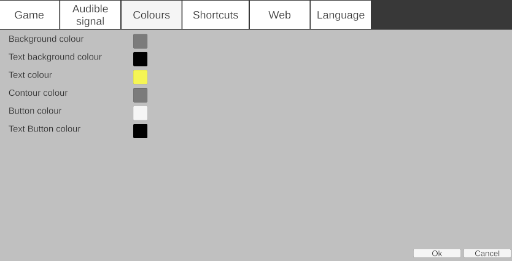

# Water-polo scoreboard

This application is designed to manage a game's scoreboard, including timekeeping, scoring, the shot clock, and team fouls.

It supports multiple platforms, including **Windows**, **Android**, and a **web-based** version. It also offers viewer functionality on additional devices and web browsers.

The score can be displayed during live streams using OBS.  
  
Image from [radio-canada](https://images.radio-canada.ca/q_auto,w_1250/v1/ici-info/sports/16x9/water-polo-mondiaux-canada-france.png)

## Setup Overview
The application runs on both Windows and Android. A web-based version is also available, though more limited.

A minimal setup includes:

+ One computer running the Main Scoreboard.
+ A second computer in Viewer mode connected to a large screen for spectators.

## Installation
+ **Windows** installer: in the Windows subfolder.
+ **Android** APK: in the Android folder.
  
For testing the web version, go to [Water-polo scoreboard](https://gcote2019.github.io/WaterPoloScoreboard/)

# ❗ Web Version Limitations
+ Cannot act as a viewer.
+ Cannot update the view-only web page.

### The welcome screen

You can choose to:
+ Operate the Main Scoreboard
+ Launch a Viewer

To connect as a viewer, select a listed server or manually enter the IP or device name of the scoreboard host.

#### Main scoreboard

## Settings
Accessed via the **Settings** button.

#### Game Settings

+ Period duration (max: 999:59)
+ Enable/disable shot clock
+ Shot clock duration
+ Timeouts per team and per period
+ Timeout duration
+ Penalty duration

#### Audible Signal

  
A sound can be configured to alert when time is running out.

#### Colour Settings

  
You can change the default interface colors.

#### Keyboard shortcuts

+ Shortcuts are currently fixed.
+ In viewer mode: press PageUp to toggle scoreboard display.

(From [tatinui](https://www.titanui.com/49580-xbox-one-controller-buttons-psd/))

If you connect an Xbox controller to your computer, you can use these buttons   
  
   : Start/Stop game clock  
   
   : Reset shot clock  
  
   : Reset shot clock (secondary value)

#### Web Server

+ Allows real-time updates of a web page scoreboard.
+ Configure under **Settings > Web**
+ Custom labels for events (e.g., goals)
  
#### Language

  
Supports **English** and **French**.

### Team names
Double-click a team name to edit. Press *Enter* to confirm.

### Score

Click the **G** button beside a player's number to log a goal:  
  

Or click **+1** to add a goal without logging the player:  

### Game Clock
When active, the clock button changes:   
  

+ Under 1 minute: shows only seconds
+ Under 10 seconds: shows tenths
+ At 0: loud buzzer sounds
  

#### Editing the Game Clock
Double-click the clock to edit.  
  
Formats:
+ mm:ss
+ mm:ss.t
+ ss
+ss.t

Max value: 999:59.9

### Shot Clock

+ Syncs with game clock
+ Under 10 seconds: shows tenths
+ At 0: buzzer plays
+ If remaining game time < shot clock: shot clock mirrors game clock
+ 
#### Editing the Shot Clock
Double-click the shot clock to set a new value.

### Time Outs
Timeouts are shown under T.O.L.
+ Click -1 to trigger a timeout
+ Shot clock is replaced by timeout clock
  

+ Press *Esc* to cancel timeout

### Fouls

Fouls are tracked per player:  

+ Click **+** to add a foul and penalty
+ Click **X** to remove

### Cap Exchange
Swap two players’ cap numbers:

  
1. Enter the two cap numbers:
  
2. Press X to confirm swap    
  

### Viewer
*(Not available in the web version)*
+ Connect via server list or IP

+ Press PageUp to switch to shot-clock-only display

Viewers require network access to the host machine..

###  Setting Up the Web Server

#### Requirements

1. Install [NodeJS](https://nodejs.org/en/download/current).
2. Verify with:
   > node -v

#### Installation Steps
1. Download and **extract** the source code

2. Go to the *webServer* subfolder
3. In a command prompt, run once:
   > npm install express  
   > npm install socket.io  
   > npm install socket.io-client  
 
4.  To start the server:
    > node index.js  
Or, to use a configuration file:
    > node index.js configuration.json  
**Example** *configuration.json*:
   > {  
   >   "port": 3000,  
   >   "password": "",  
   >   "html_file": "index.html"  
   > }  
   
You can run multiple instances of the web server on the same machine. But each instance needs a different port.
   * Two parameters can be configured. 
     * The port is 3000 par default but it can be modified
     * To prevent others from modifying the scoreboard, you can also supply a password.
*  run the command
*  node index.js configuration.json  
  
where the file "configuration.json" contains
{
  "port":3000,
  "password": "",
  "html_file": "index.html"
}

View the page in your browser:
[localhost:3000](localhost:3000)

In the application:
Go to **Settings > Web** and enter the same address.

##### Make it public
If the web server is running on a local machine, the web page isn't accessible to the outside world. It is possible to open it for everyone if you have access to the router. Configure port forwarding for port 3000. Protocol is TCP.

If you are tech savvy, you could also set up a machine on the cloud, for instance, Oracle Cloud _*free*_ tier and install the web server on it. You get an ip address to connect to that machine.

You can also use a free dynamic DNS service provider [dynu.com](https://www.dynu.com/en-US/) to get an easy to remember domain name that points to that machine.

You can try scoreboard.ddnsgeek.com:3000 which is a machine on Oracle Cloud running an instance of the server. Beware that it may be in use by other users.

#### Streaming with OBS
Once the web server is running, you can launch a second web server with this command
* node obs.js another_configuration_file.json 
By default, the OBS server listens to http://localhost:3000 and uses the port 3001
You can view the new page by visiting the page http://ip_address:3001, You can test on the same computer by opening the page localhost:3001 in your browser.
In OBS, add a source to the scene
  
Select Browser and give it a name
  
  
You can change the colour of the text. By default, it is black.
Once done, you can position the text
  
and you get something like this
  
If the text is not visible, you may have to click on the transition button. 

If you provide a configuration file, you can modify which server it listens to and its own port
* node obs.js another_configuration_file.json  
  
{
  "server": "http://localhost:3000",
  "port_obs":3001,
  "password":"",
  "html_file": "obs.html"
}

Check the file *obs_3000_3001.json* for more information.

#### Remote viewer
If the main scoreboard is running on a local machine, once again, a remote viewer can't connect to it unless you enable port forwarding for port 8368. Once the port is opened to the outside world, a viewer can connect to it by entering the WAN ip address.

